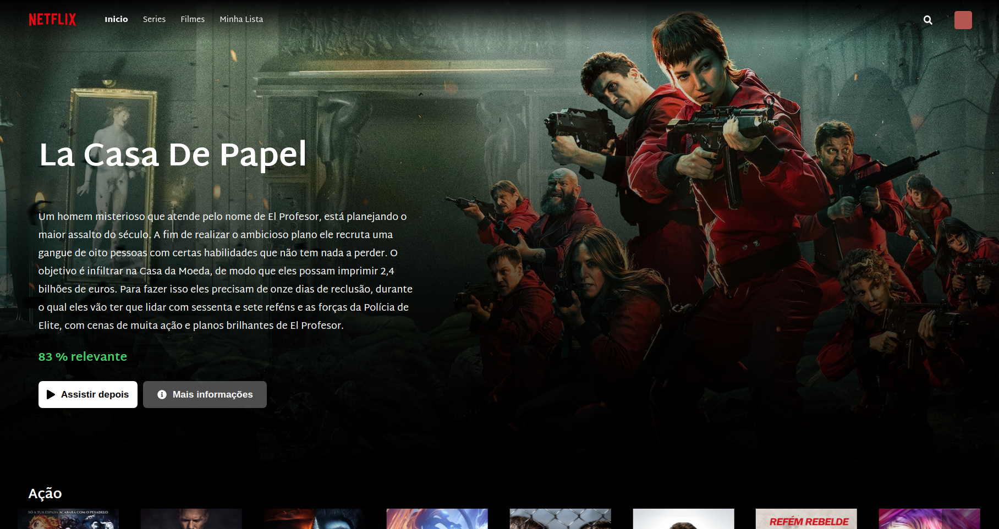
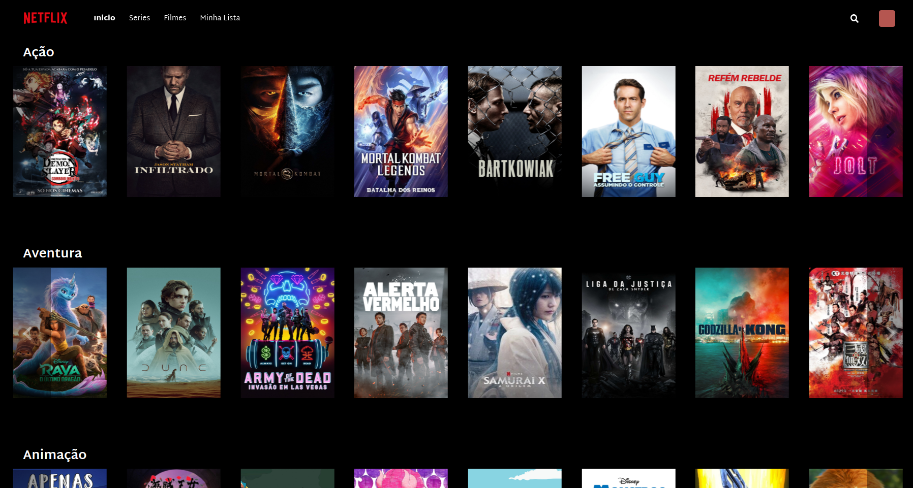
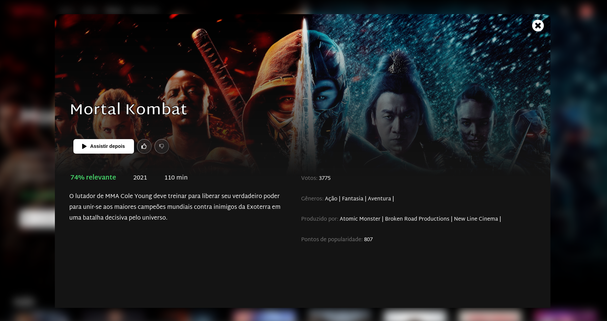
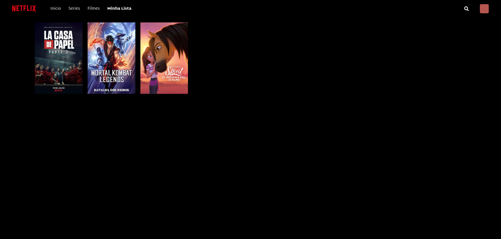
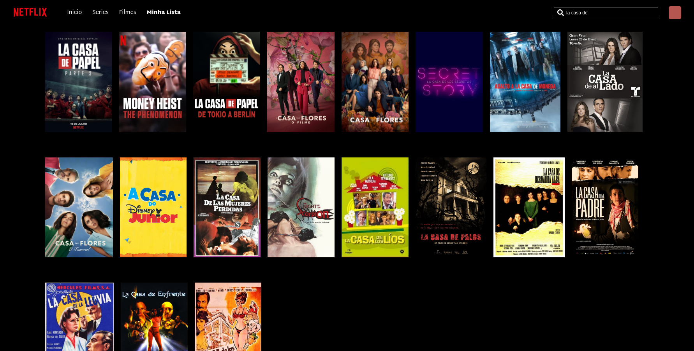

# Boas vindas ao repositório do projeto Netflix Clone!

Olá seja bem vindo(a) ao meu projeto Netflix Clone, esse projeto pessoal foi desenvolvido com o intuito de fazer uma aplicação web inspirada na Netflix.

---

# Sumário

- [Habilidades treinadas](#habilidades-treinadas)
- [A aplicação](#a-aplicação)
- [Instruções para acessar o projeto](#instruções-para-acessar-o-projeto)
- [Acessar aplicação](#acessar-aplicação)

# Habilidades treinadas

- Manipular a biblioteca React.
- Utilização de Hooks e Context API.
- Estilização usando CSS em conjunto com Styled Components.

# Dificuldades durante o desenvolvimento
  - Leitura da documentação da Api e entendimento de como utilizá-la
  - Estruturação de um carrosel similar ao da Netflix (Usado biblioteca Alice-Carousel)
  - Animações usando CSS para elementos da paǵina
  - Responsividade para telas desktop menores
  - Tratamento dos dados da API de filmes pois alguns dados vinham faltando e ocasionavam quebra da página.

--- 
# A aplicação
### Início da aplicação

  
### Como ficaram os carrosséis

  
### Detalhes do item selecionado

  
### Campo "Minha Lista" dos filmes marcados pelo usuário

  
### Buscando itens na aplicação

---

## Instruções para acessar o projeto:

1. Clone o repositório
  * `git clone git@github.com:LeoFuna/Netflix-Clone.git`.
  * Entre na pasta do repositório que você acabou de clonar:
    * `cd netflix-clone`

2. Instale as dependências:
  * `npm install`

3. Inicialize o projeto:
  * `npm start`

---

# Acessar aplicação
- [Ver em funcionamento](https://leofuna.github.io/Netflix-Clone/)
